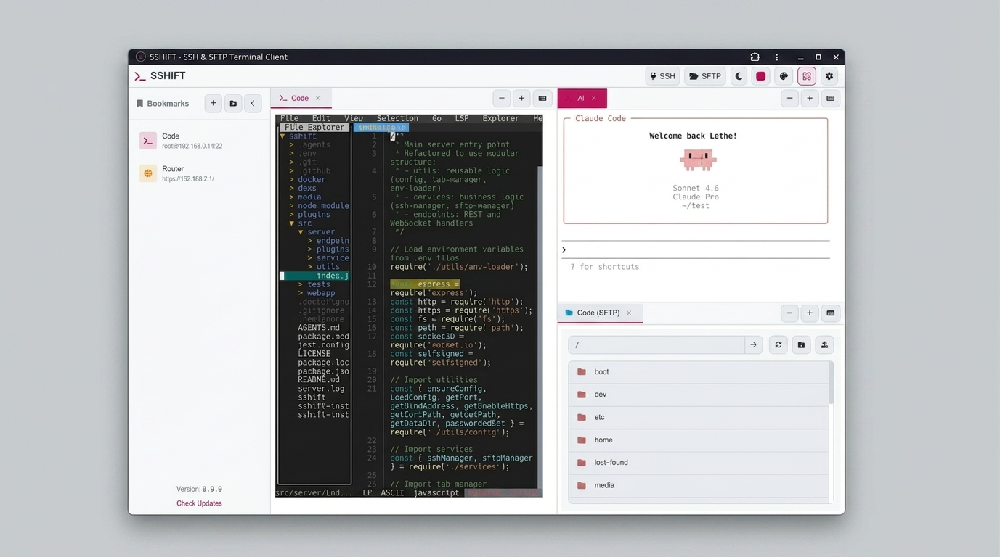
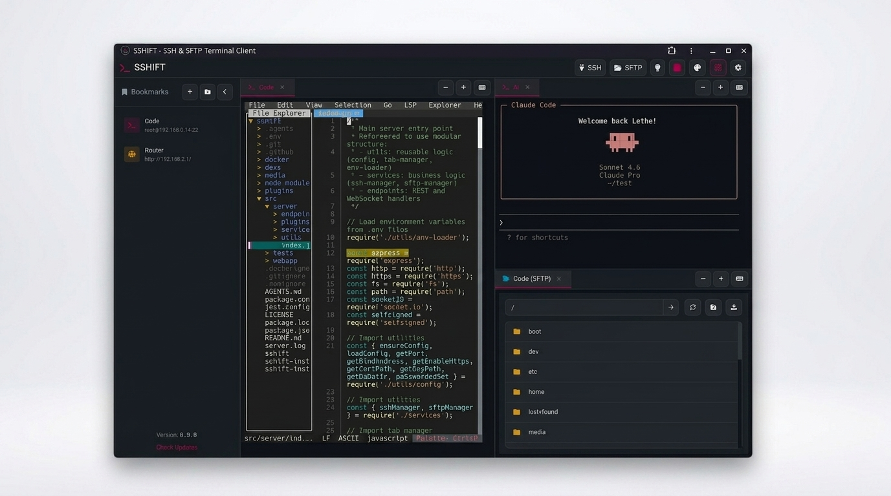
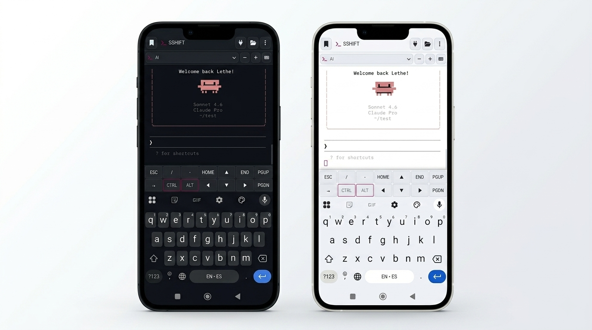

# SSHIFT - Web-based SSH/SFTP Terminal Client for the AI Stack

[](https://lethevimlet.github.io/sshift/)
[](https://www.npmjs.com/package/@lethevimlet/sshift)
[](https://github.com/lethevimlet/sshift/pkgs/container/sshift)
[](https://opensource.org/licenses/MIT)

A modern, responsive web-based SSH and SFTP terminal client built with Node.js, Express, and xterm.js. Designed for the AI coding workflow — featuring tab flash notifications that alert you when AI tools like OpenCode or Claude are waiting for your input, so you never miss a prompt while multitasking. Also features excellent TUI support, tabbed sessions, bookmarks, and mobile-friendly design.

## 📸 Screenshots

<div align="center">
  
  
</div>
<br>
<div align="center">
  
</div>

## ✨ Features

- 🔐 **SSH Terminal** - Full xterm.js emulation with TUI support (vim, nano, htop, tmux)
- 📁 **SFTP Browser** - File manager interface with upload/download
- 🔗 **Persistent Sessions** - Background SSH sessions stay alive even while browsing
- 🤖 **AI Attention Alerts** - Tab flash notifications when AI tools (OpenCode, Claude) need your input
- 🗂️ **Tabbed Interface** - Multiple concurrent sessions
- 🔖 **Bookmarks** - Save connection details for quick access
- 🔒 **Password Protection** - Optional password lock for app access
- ⌨️ **Mobile-Friendly** - Special keys popup for mobile devices
- 🎨 **Modern UI** - Configurable light/dark themes, accent colors, terminal color schemes, fully responsive

## 🚀 Quick Start

**Linux/macOS:**
```bash
curl -fsSL https://raw.githubusercontent.com/lethevimlet/sshift/main/sshift-install.sh | bash
```

**Windows (PowerShell):**
```powershell
Set-ExecutionPolicy Bypass -Scope Process
Invoke-Expression (Invoke-WebRequest -Uri "https://raw.githubusercontent.com/lethevimlet/sshift/main/sshift-install.ps1" -UseBasicParsing).Content
```

The installer handles Node.js, npm, autostart, and HTTPS config automatically. The application will be available at `https://localhost:8022`

Alternatively, install globally via npm:

```bash
npm install -g @lethevimlet/sshift
sshift
```

> **Note:** When installing via npm, you'll need to configure autostart yourself (e.g., systemd, launchd, or Task Scheduler).

## 📖 Documentation

Full documentation is available at [GitHub Pages](https://lethevimlet.github.io/sshift/).

- **[Installation](docs/installation.md)** - Detailed installation options
- **[Docker](docs/docker.md)** - Docker deployment and usage
- **[Configuration](docs/configuration.md)** - Configuration files and options
- **[Plugins](docs/configuration.md#plugins)** - AI attention alerts and plugin system
- **[API Reference](docs/api-reference.md)** - Socket.IO events and API
- **[Testing](docs/testing.md)** - Running and writing tests
- **[Contributing](docs/contributing.md)** - How to contribute

## 📦 Installation

### One-Liner Installation (Recommended)

The recommended way to install sshift - automatically handles updates and autostart configuration:

**Linux/macOS:**
```bash
curl -fsSL https://raw.githubusercontent.com/lethevimlet/sshift/main/sshift-install.sh | bash
```

**Windows (PowerShell):**

```powershell
Set-ExecutionPolicy Bypass -Scope Process
Invoke-Expression (Invoke-WebRequest -Uri "https://raw.githubusercontent.com/lethevimlet/sshift/main/sshift-install.ps1" -UseBasicParsing).Content
```

> **Note:** The Windows installer requires PowerShell to be run as Administrator for npm global installations.

The installer will:
- Install Node.js 20+ if not present
- Install sshift globally via npm
- Start sshift after installation
- Configure autostart (optional, systemd on Linux, launchd on macOS, Task Scheduler on Windows)
- Create config at `~/.local/share/sshift/.env/config.json` with HTTPS enabled
- Print summary with HTTPS access links

### Docker

```bash
docker run -d -p 8022:8022 --name sshift ghcr.io/lethevimlet/sshift:latest

# Or with docker-compose
curl -O https://raw.githubusercontent.com/lethevimlet/sshift/main/docker/docker-compose.yml
docker-compose up -d
```

See [Docker README](docker/README.md) for detailed instructions.

### npm

```bash
npm install -g @lethevimlet/sshift
sshift
```

### From Source (GitHub)

```bash
git clone https://github.com/lethevimlet/sshift.git
cd sshift
npm install
npm start
```

## 🖥️ CLI Reference

```
sshift                      Start server on default port (8022)
sshift --dev                Start in development mode (port 3000, separate PID)
sshift --port 8080          Start server on custom port
sshift --bind 127.0.0.1     Bind to specific address
sshift --status             Check if sshift is running
sshift --stop               Stop running instance
sshift --restart            Restart running instance
sshift --dev --status       Check if dev instance is running
sshift --dev --stop         Stop dev instance
sshift --dev --restart      Restart dev instance
sshift --help               Show help message
```

| Flag | Shorthand | Description |
|------|-----------|-------------|
| `--port <port>` | `-p` | Server port (default: 8022, dev: 3000) |
| `--bind <addr>` | `-b` | Bind address (default: 0.0.0.0) |
| `--dev` | `-d` | Development mode — uses `devPort` from config (default 3000) and a separate PID file so dev and production instances can run side-by-side |
| `--stop` | `-s` | Stop running instance |
| `--restart` | `-r` | Restart running instance |
| `--status` | | Check running status |
| `--help` | `-h` | Show help message |

> **Note:** `--dev` sets `NODE_ENV=development`, which switches the default port from 8022 to 3000 (or `devPort` from `config.json`). It also uses a separate PID file (`.sshift-dev.pid`) so you can run a dev instance alongside production and use `--dev --status`/`--dev --stop`/`--dev --restart` to manage it independently.

## ⚙️ Configuration

SSHIFT uses a priority-based configuration system. Config files are searched in order; the first match wins.

### Config File Search (first match wins)

| Priority | Path | Notes |
|----------|------|-------|
| 1 | `<PACKAGE_DIR>/.env/config.json` | NPM package directory |
| 2 | `<PACKAGE_DIR>/config.json` | NPM package root (fallback) |
| 3 | `~/.local/share/sshift/.env/config.json` | User install location |
| 4 | `~/.local/share/sshift/config.json` | User install (no `.env` subdir) |

### Port Priority

1. `--port` CLI argument (highest priority)
2. `PORT` environment variable
3. `config.json` `devPort` (when `NODE_ENV=development` or `--dev`)
4. `config.json` `port` (production)
5. Default: 8022 (production), 3000 (development)

### Bind Address Priority

1. `--bind` CLI argument
2. `BIND` environment variable
3. `config.json` `bind` setting
4. Default: `0.0.0.0`

See [Configuration](docs/configuration.md) for details.

## 🔒 HTTPS on Local Network (PWA / "Not Secure" Warnings)

When accessing sshift from a LAN IP (e.g., `https://192.168.1.50:8022`), browsers show "Not Secure" warnings because the self-signed certificate is not trusted. This also blocks PWA installation, which requires a trusted secure context.

### Recommended: Trust the Auto-Generated Certificate

sshift automatically generates a self-signed TLS certificate on first run. The simplest fix is to add this certificate to your device's trusted root store:

1. **Download the certificate** — visit `https://<your-sshift-host>:8022/api/cert` in your browser, or find it at `~/.local/share/sshift/ssl-cert.pem` on the server
2. **Add it to your device's trusted root store:**
   - **Windows:** Double-click the file → Install Certificate → Local Machine → Trusted Root Certification Authorities
   - **macOS:** Double-click the file → Add to Keychain → Set "Always Trust" in Keychain Access
   - **Linux:** Copy to `/usr/local/share/ca-certificates/` and run `sudo update-ca-certificates`
   - **Android:** Settings → Security → Install from storage
   - **iOS:** Send via AirDrop/email → Open → Install profile → Settings → General → About → Certificate Trust Settings → Enable full trust

After trusting the certificate, the "Not Secure" warning will disappear and PWA installation will work.

### Using Your Own Certificate

You can provide your own TLS certificate via `config.json`:

```json
{
  "enableHttps": true,
  "certPath": "/path/to/your/certificate.pem",
  "keyPath": "/path/to/your/private-key.pem"
}
```

Both `certPath` and `keyPath` must be set together. See [Configuration > HTTPS on Local Network](docs/configuration.md) for full instructions including nginx reverse proxy and mDNS options.

### HTTP → HTTPS Redirect

By default, sshift automatically redirects any plain HTTP requests to HTTPS on the same port — so visiting `http://192.168.1.50:8022` seamlessly upgrades to `https://`. This is controlled by the `httpRedirect` setting (enabled by default). To disable it:

```json
{
  "enableHttps": true,
  "httpRedirect": false
}
```

## 🤖 AI Attention Plugins

SSHIFT includes built-in plugins that detect when AI coding tools are waiting for user input and flash the browser tab to get your attention — perfect for when you're multitasking across tabs.

### OpenCode Attention

Detects when [OpenCode](https://opencode.ai) is waiting for input by tracking its spinner characters (⬝ ■ ▣) and prompt patterns. When the spinner stops or a prompt appears, the tab flashes.

### Claude Attention

Detects when [Claude Code](https://claude.ai) is waiting for input by tracking its spinner characters (⠋⠙⠹ braille patterns, ·✢✳✶✻✽) and prompt patterns like "❯", "Do you want", "Allow", and "Esc to cancel".

### Enabling Plugins

Add plugins to your `config.json`:

```json
{
  "plugins": [
    {
      "name": "opencode-attention",
      "enabled": true,
      "config": {
        "debounceMs": 300,
        "flashDuration": 0,
        "idleThreshold": 3000
      }
    },
    {
      "name": "claude-attention",
      "enabled": true,
      "config": {
        "debounceMs": 300,
        "flashDuration": 0,
        "idleThreshold": 3000,
        "cooldownMs": 1000
      }
    }
  ]
}
```

See [Configuration > Plugins](docs/configuration.md#plugins) for full details.

## 🛠️ Technology Stack

**Backend:** Node.js, Express, Socket.IO, ssh2  
**Frontend:** xterm.js, xterm addons  
**Development:** ESLint, Puppeteer

## 🤝 Contributing

Contributions are welcome! See [Contributing](docs/contributing.md) for guidelines.

## 📄 License

MIT License - see [LICENSE](LICENSE) for details.

## 🙏 Acknowledgments

- [xterm.js](https://xtermjs.org/) - Terminal emulator for the web
- [ssh2](https://github.com/mscdex/ssh2) - SSH2 client and server modules
- [Socket.IO](https://socket.io/) - Real-time bidirectional event-based communication

## 📞 Support

- **Issues**: [GitHub Issues](https://github.com/lethevimlet/sshift/issues)
- **Discussions**: [GitHub Discussions](https://github.com/lethevimlet/sshift/discussions)

---

**Made with ❤️ by the SSHIFT Team**
