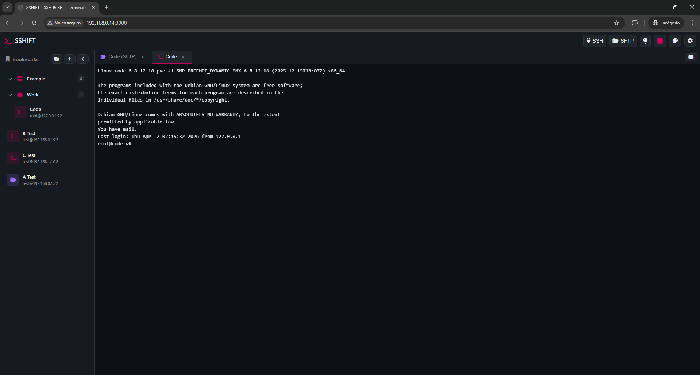
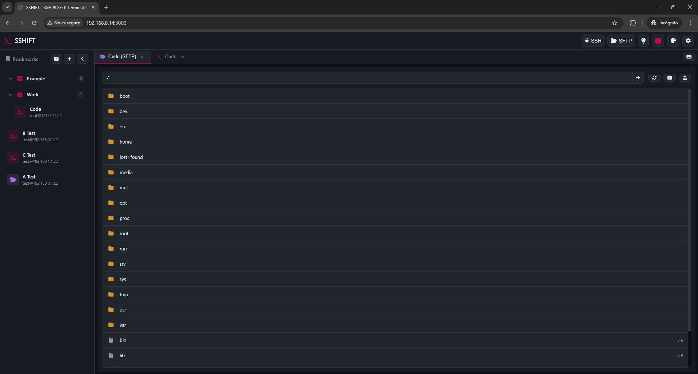

# SSHIFT - Web-based SSH & SFTP Terminal Client

[](https://nodejs.org/)
[](https://opensource.org/licenses/MIT)

A modern, responsive web-based SSH and SFTP terminal client built with Node.js, Express, and xterm.js. Features excellent TUI support, tabbed sessions, bookmarks, and mobile-friendly design.


## 📸 Screenshots

<div align="center">
  
  
</div>

## ✨ Features

### 🔐 SSH Terminal
- Full-featured terminal emulation with **xterm.js**
- Excellent **TUI support** (vim, nano, htop, tmux, etc.)
- **256-color** and **true color** support
- Proper terminal resizing
- Clickable web links
- Alternate buffer support (for TUI applications)

### 📁 SFTP Browser
- Browse remote directories with a file manager interface
- **Download files** (click to download)
- **Upload files** (drag & drop or file picker)
- Create directories
- Delete files and directories
- File size and permissions display

### 🗂️ Tabbed Interface
- Multiple concurrent SSH and SFTP sessions
- Switch between sessions with tabs
- Visual session indicators
- Easy tab management (close, reorder)
- Session persistence

### 🔖 Bookmarks
- Save connection details for quick access
- Edit and delete bookmarks
- Persistent storage in configuration file
- Quick connect from sidebar

### ⌨️ Special Keys Popup
- **Mobile-friendly** special keys input
- Ctrl+C, Ctrl+D, Ctrl+Z, etc.
- Function keys F1-F12
- Arrow keys and navigation keys
- Triggered by clicking on tabs (mobile)

### 🎨 Modern UI
- **GitHub-inspired dark theme**
- Easy on the eyes
- High contrast for readability
- Fully responsive design
- Works on desktop, tablet, and mobile

## 📦 Installation

### Prerequisites
- **Node.js** >= 14.0.0 (installed automatically by the installer if not present)
- **npm** or **yarn**

### One-Liner Installation

The easiest way to install sshift is using our installation scripts:

#### Linux / macOS

```bash
curl -fsSL https://raw.githubusercontent.com/lethevimlet/sshift/main/install.sh | bash
```

Or with wget:

```bash
wget -qO- https://raw.githubusercontent.com/lethevimlet/sshift/main/install.sh | bash
```

#### Windows (PowerShell)

```powershell
Invoke-Expression (Invoke-WebRequest -Uri "https://raw.githubusercontent.com/lethevimlet/sshift/main/install.ps1" -UseBasicParsing).Content
```

Or with curl (Windows 10+):

```powershell
curl -fsSL https://raw.githubusercontent.com/lethevimlet/sshift/main/install.ps1 | powershell -Command "$input | Invoke-Expression"
```

### Custom Installation Options

You can customize the installation with command-line arguments:

#### Linux / macOS

```bash
# Install with custom port
curl -fsSL https://raw.githubusercontent.com/lethevimlet/sshift/main/install.sh | bash -s -- --port 8080

# Install to custom directory
curl -fsSL https://raw.githubusercontent.com/lethevimlet/sshift/main/install.sh | bash -s -- --install-dir /opt/sshift

# Install with custom port and directory
curl -fsSL https://raw.githubusercontent.com/lethevimlet/sshift/main/install.sh | bash -s -- --port 8080 --install-dir /opt/sshift

# Show help
./install.sh --help
```

#### Windows (PowerShell)

```powershell
# Install with custom port
Invoke-WebRequest -Uri "https://raw.githubusercontent.com/lethevimlet/sshift/main/install.ps1" -OutFile "install.ps1"
.\install.ps1 -Port 8080

# Install to custom directory
.\install.ps1 -InstallDir "C:\sshift"

# Install with custom port and directory
.\install.ps1 -Port 8080 -InstallDir "C:\sshift"

# Show help
.\install.ps1 -Help
```

### Uninstallation

To remove sshift from your system:

#### Linux / macOS

```bash
./install.sh --uninstall
```

Or download and run:

```bash
curl -fsSL https://raw.githubusercontent.com/lethevimlet/sshift/main/install.sh | bash -s -- --uninstall
```

#### Windows (PowerShell)

```powershell
.\install.ps1 -Uninstall
```

### What the Installer Does

1. **Checks for Node.js** - Installs Node.js 18+ if not present
2. **Clones the repository** - Downloads sshift to `~/.local/share/sshift` (or custom directory)
3. **Installs dependencies** - Runs `npm install` automatically
4. **Creates executable** - Sets up `sshift` command in your PATH
5. **Configures autostart** (optional) - Sets up sshift to start on boot
6. **Checks for updates** - Compares local and remote versions

### Manual Installation

If you prefer to install manually:

```bash
# Clone the repository
git clone https://github.com/lethevimlet/sshift.git
cd sshift

# Install dependencies
npm install

# Start the server
npm start
```

The application will be available at `http://localhost:8022` (default production port)

### Development Mode

```bash
# Start in development mode (port 3000)
npm run dev
```

### Port Configuration

SSHIFT uses a flexible port configuration system with the following priority:

1. **PORT environment variable** (highest priority)
2. **config.json** `port`/`devPort` settings
3. **Default ports**: 8022 (production), 3000 (development)

```bash
# Run on custom port
PORT=9000 ./sshift

# Run in development mode (uses devPort from config or 3000)
NODE_ENV=development ./sshift

# Or configure in config.json
{
  "port": 8022,      # Production port
  "devPort": 3000    # Development port
}
```

### Bind Address Configuration

SSHIFT can bind to a specific network interface. By default, it binds to `0.0.0.0` (all interfaces).

1. **BIND environment variable** (highest priority)
2. **config.json** `bind` setting
3. **Default**: `0.0.0.0` (all interfaces)

```bash
# Bind to localhost only (no external access)
BIND=127.0.0.1 ./sshift

# Bind to specific interface
BIND=192.168.1.100 ./sshift

# Or configure in config.json
{
  "bind": "0.0.0.0"  # Bind to all interfaces (default)
}
```

## ⚙️ Configuration

### Configuration Files

SSHIFT uses a **priority-based configuration system** with multiple config file locations:

#### Environment Variables (`.env` files)

Environment variables are loaded from the following locations in **priority order** (highest to lowest):

1. `.env/.env.local` - **User-specific, private config** (highest priority)
2. `.env.local` - User-specific config in root (backward compatibility)
3. `.env/.env` - Shared environment config
4. `.env` - Default environment config (lowest priority)

**Example `.env/.env.local`:**
```env
# SSH Test Credentials
SSH_HOST=192.168.1.100
SSH_PORT=22
SSH_USER=myuser
SSH_PASS=mypassword

# Or use TEST_* variables
TEST_HOST=192.168.1.100
TEST_PORT=22
TEST_USER=testuser
TEST_PASS=testpassword
```

#### Configuration File (`config.json`)

The application configuration (bookmarks, settings) is loaded from:

1. `.env/config.json` - **User-specific, private config** (highest priority)
2. `config.json` - Default config in root (lowest priority)

**Example `.env/config.json`:**
```json
{
  "port": 8022,
  "devPort": 3000,
  "bind": "0.0.0.0",
  "bookmarks": [
    {
      "id": "1701234567890",
      "name": "Production Server",
      "host": "prod.example.com",
      "port": 22,
      "username": "deploy",
      "type": "ssh"
    },
    {
      "id": "1701234567891",
      "name": "Development Server",
      "host": "dev.example.com",
      "port": 22,
      "username": "developer",
      "type": "ssh"
    }
  ],
  "settings": {
    "fontSize": 14,
    "fontFamily": "'Courier New', monospace",
    "theme": "dark"
  }
}
```

#### Custom Layouts

SSHIFT supports custom terminal layouts that can be defined in `config.json`. Layouts allow you to split your terminal into multiple panels for multitasking.

**Layout Structure:**

Each layout consists of:
- `id` - Unique identifier
- `name` - Display name shown in the UI
- `icon` - Lucide icon name (e.g., "square", "columns-2", "grid-2x2")
- `columns` - Array of column definitions

Each column has:
- `width` - Column width (percentage string, e.g., "50%", "33.33%")
- `rows` - Array of row definitions within the column

Each row has:
- `height` - Row height (percentage string, e.g., "100%", "50%")

**Example Custom Layouts:**

```json
{
  "layouts": [
    {
      "id": "single",
      "name": "Single",
      "icon": "square",
      "columns": [
        {
          "width": "100%",
          "rows": [
            {
              "height": "100%"
            }
          ]
        }
      ]
    },
    {
      "id": "2-columns",
      "name": "2 Columns",
      "icon": "columns-2",
      "columns": [
        {
          "width": "50%",
          "rows": [
            {
              "height": "100%"
            }
          ]
        },
        {
          "width": "50%",
          "rows": [
            {
              "height": "100%"
            }
          ]
        }
      ]
    },
    {
      "id": "mixed",
      "name": "Mixed",
      "icon": "layout-panel-left",
      "columns": [
        {
          "width": "50%",
          "rows": [
            {
              "height": "100%"
            }
          ]
        },
        {
          "width": "50%",
          "rows": [
            {
              "height": "50%"
            },
            {
              "height": "50%"
            }
          ]
        }
      ]
    },
    {
      "id": "quad",
      "name": "4 Panels",
      "icon": "grid-2x2",
      "columns": [
        {
          "width": "50%",
          "rows": [
            {
              "height": "50%"
            },
            {
              "height": "50%"
            }
          ]
        },
        {
          "width": "50%",
          "rows": [
            {
              "height": "50%"
            },
            {
              "height": "50%"
            }
          ]
        }
      ]
    },
    {
      "id": "triple-stack",
      "name": "Triple Stack",
      "icon": "grip-lines",
      "columns": [
        {
          "width": "100%",
          "rows": [
            {
              "height": "33.33%"
            },
            {
              "height": "33.33%"
            },
            {
              "height": "33.34%"
            }
          ]
        }
      ]
    }
  ]
}
```

**Layout Priority:**

SSHIFT loads layouts in the following order (first found wins):

1. **`config.json`** (via `/api/config`) - Custom layouts from config
2. **`src/webapp/layouts.json`** - Default layouts file
3. **Built-in defaults** - Hardcoded fallback layouts

**Tips for Custom Layouts:**

- Ensure width percentages add up to 100% across columns
- Ensure height percentages add up to 100% within each column
- Use unique `id` values for each layout
- Choose appropriate Lucide icon names for better UI consistency
- Common icons: `square`, `columns-2`, `columns-3`, `grid-2x2`, `layout-panel-left`, `grip-lines`

**Complete Example with Layouts:**

```json
{
  "port": 8022,
  "devPort": 3000,
  "bind": "0.0.0.0",
  "bookmarks": [
    {
      "id": "1701234567890",
      "name": "Production Server",
      "host": "prod.example.com",
      "port": 22,
      "username": "deploy",
      "type": "ssh"
    }
  ],
  "settings": {
    "fontSize": 14,
    "fontFamily": "'Courier New', monospace",
    "theme": "dark"
  },
  "layouts": [
    {
      "id": "custom-3-panels",
      "name": "3 Panels",
      "icon": "columns-3",
      "columns": [
        {
          "width": "33.33%",
          "rows": [{ "height": "100%" }]
        },
        {
          "width": "33.33%",
          "rows": [{ "height": "100%" }]
        },
        {
          "width": "33.34%",
          "rows": [{ "height": "100%" }]
        }
      ]
    }
  ]
}
```

### Why Multiple Config Locations?

- **`.env/` directory** - Git-ignored, perfect for sensitive data (passwords, keys, production credentials)
- **Root config files** - Can be committed to git for shared team settings
- **Priority system** - User-specific settings override shared defaults

### Git Ignore

The `.gitignore` file automatically excludes:
```
.env/
.env.local
.env.*.local
config.json
```

This ensures sensitive credentials never get committed to version control.

## 🚀 Usage

### Command Line Interface

SSHIFT provides a command-line interface for managing the server:

#### sshift Executable (Linux/macOS)

```bash
# Start server on default port (8022)
sshift

# Start server on custom port
sshift --port 8080
sshift -p 8080

# Bind to specific address (default: 0.0.0.0 - all interfaces)
sshift --bind 127.0.0.1
sshift -b 192.168.1.100

# Start in development mode (port 3000)
sshift --dev
sshift -d

# Stop running instance
sshift --stop
sshift -s

# Restart running instance
sshift --restart
sshift -r

# Check if sshift is running
sshift --status

# Show help message
sshift --help
sshift -h
```

#### sshift Executable (Windows)

```powershell
# Start server on default port (8022)
sshift

# Start server on custom port
sshift --port 8080
sshift -p 8080

# Bind to specific address
sshift --bind 127.0.0.1
sshift -b 192.168.1.100

# Start in development mode (port 3000)
sshift --dev
sshift -d

# Stop running instance
sshift --stop
sshift -s

# Restart running instance
sshift --restart
sshift -r

# Check if sshift is running
sshift --status

# Show help message
sshift --help
sshift -h
```

#### Environment Variables

You can also use environment variables to configure sshift:

```bash
# Override port
PORT=8080 sshift

# Override bind address
BIND=127.0.0.1 sshift

# Development mode
NODE_ENV=development sshift
```

#### Port Priority

SSHIFT uses the following priority for determining the port:

1. `--port` CLI argument (highest priority)
2. `PORT` environment variable
3. `config.json` `port`/`devPort` based on `NODE_ENV`
4. Default: 8022 (production), 3000 (development)

### Installer Scripts

The installer scripts also support various commands:

#### Linux/macOS (install.sh)

```bash
# Install with custom options
./install.sh --install-dir /opt/sshift --port 8080

# Update existing installation
./install.sh --update

# Start sshift
./install.sh --start

# Stop sshift
./install.sh --stop

# Restart sshift
./install.sh --restart

# Check if sshift is running
./install.sh --status

# Uninstall sshift
./install.sh --uninstall

# Show help
./install.sh --help
```

#### Windows (install.ps1)

```powershell
# Install with custom options
.\install.ps1 -InstallDir "C:\sshift" -Port 8080

# Update existing installation
.\install.ps1 -Update

# Start sshift
.\install.ps1 -Start

# Stop sshift
.\install.ps1 -Stop

# Restart sshift
.\install.ps1 -Restart

# Check if sshift is running
.\install.ps1 -Status

# Uninstall sshift
.\install.ps1 -Uninstall

# Show help
.\install.ps1 -Help
```

### SSH Connection

1. Click the **"SSH"** button in the header
2. Enter connection details:
   - **Host** (hostname or IP address)
   - **Port** (default: 22)
   - **Username**
   - **Password** or **Private Key**
3. Click **"Connect"**

### SFTP Connection

1. Click the **"SFTP"** button in the header
2. Enter connection details (same as SSH)
3. Use the file browser to:
   - **Navigate** directories (double-click)
   - **Download files** (click on file)
   - **Upload files** (upload button)
   - **Create directories** (folder button)
   - **Delete** files/folders (trash icon)

### Bookmarks

1. Click the **"+"** button in the sidebar
2. Enter bookmark details
3. Click **"Save"**
4. Click on a bookmark to quick-connect

### Special Keys (Mobile)

- Click the **keyboard icon** in the tabs bar
- On mobile, **tap on a tab** to show special keys
- Click any key to send it to the active session

## 🔒 Security & Multi-User Setup

### ⚠️ Important Security Notes

**SSHIFT is designed for single-user or trusted environments.** It does NOT include built-in authentication or multi-user support.

### Single User / Trusted Environment

For personal use or trusted networks:
- Run on `localhost` only (default)
- Use behind a firewall
- No additional setup needed

### Multi-User or Production Deployment

**If you need multi-user access or authentication, you MUST use a reverse proxy with authentication.**

Recommended authentication solutions:
- **Nginx + HTTP Basic Auth** - Simple password protection
- **Authelia** - Full-featured SSO with 2FA/MFA support
- **Cloudflare Access** - Zero-trust authentication (no server config needed)
- **OAuth2 Proxy** - Google, GitHub, or other OAuth providers
- **Keycloak** - Enterprise SSO solution

For detailed setup instructions, see the documentation of your chosen authentication solution.

### Production Checklist

- [ ] Use **HTTPS/WSS** (SSL/TLS required)
- [ ] Configure **reverse proxy** with authentication
- [ ] Set up **firewall rules** (limit access by IP)
- [ ] Use **strong passwords** for SSH connections
- [ ] Consider **SSH key authentication** instead of passwords
- [ ] Enable **rate limiting** in your reverse proxy
- [ ] Set up **logging** and monitoring
- [ ] Keep **Node.js** and dependencies updated

## 🧪 Testing

SSHIFT includes comprehensive test suites for SSH and SFTP functionality.

### Test Setup

Tests use environment variables from `.env` files (see Configuration section).

```bash
# Create test environment file
cp .env/config.json.example .env/config.json
# Edit with your test server credentials
nano .env/.env.local
```

### Run Tests

```bash
# Run all tests
npm test

# Run specific test file
node src/tests/test-client.js

# Run with verbose output
DEBUG=* npm test
```

### Test Files

- `src/tests/test-client.js` - Socket.IO and SSH connection tests
- `src/tests/test-server.js` - HTTP server tests
- `src/tests/test-helper.js` - Test utilities and configuration

## 🛠️ Technology Stack

### Backend
- **Node.js** - JavaScript runtime
- **Express** - Web server framework
- **Socket.IO** - WebSocket communication
- **ssh2** - SSH2 client and server modules

### Frontend
- **xterm.js** - Terminal emulator
- **xterm-addon-fit** - Terminal resizing
- **xterm-addon-web-links** - Clickable links
- **xterm-addon-search** - Search in terminal

### Development
- **ESLint** - Code linting
- **Puppeteer** - Browser testing

## 📝 API Reference

### Socket.IO Events

#### Client → Server

```javascript
// SSH Connection
socket.emit('ssh-connect', {
  sessionId: 'unique-session-id',
  host: 'example.com',
  port: 22,
  username: 'user',
  password: 'pass',
  cols: 80,
  rows: 24
});

// SSH Data
socket.emit('ssh-data', {
  sessionId: 'session-id',
  data: 'ls -la\n'
});

// SSH Resize
socket.emit('ssh-resize', {
  sessionId: 'session-id',
  cols: 120,
  rows: 40
});

// SSH Disconnect
socket.emit('ssh-disconnect', {
  sessionId: 'session-id'
});

// SFTP Connection
socket.emit('sftp-connect', {
  sessionId: 'unique-session-id',
  host: 'example.com',
  port: 22,
  username: 'user',
  password: 'pass'
});

// SFTP List Directory
socket.emit('sftp-list', {
  sessionId: 'session-id',
  path: '/home/user'
});
```

#### Server → Client

```javascript
// SSH Connected
socket.on('ssh-connected', (data) => {
  console.log('Session ID:', data.sessionId);
});

// SSH Data
socket.on('ssh-data', (data) => {
  console.log('Output:', data.data);
});

// SSH Error
socket.on('ssh-error', (data) => {
  console.error('Error:', data.message);
});

// SFTP Connected
socket.on('sftp-connected', (data) => {
  console.log('SFTP Session ID:', data.sessionId);
});

// SFTP List Result
socket.on('sftp-list-result', (data) => {
  console.log('Files:', data.files);
});
```

## 🤝 Contributing

Contributions are welcome! Please feel free to submit a Pull Request.

1. Fork the repository
2. Create your feature branch (`git checkout -b feature/AmazingFeature`)
3. Commit your changes (`git commit -m 'Add some AmazingFeature'`)
4. Push to the branch (`git push origin feature/AmazingFeature`)
5. Open a Pull Request

## 📄 License

This project is licensed under the MIT License - see the [LICENSE](LICENSE) file for details.

## 🙏 Acknowledgments

- [xterm.js](https://xtermjs.org/) - Terminal emulator for the web
- [ssh2](https://github.com/mscdex/ssh2) - SSH2 client and server modules
- [Socket.IO](https://socket.io/) - Real-time bidirectional event-based communication

## 📞 Support

- **Issues**: [GitHub Issues](https://github.com/your-repo/sshift/issues)
- **Discussions**: [GitHub Discussions](https://github.com/your-repo/sshift/discussions)

---

**Made with ❤️ by the SSHIFT Team**